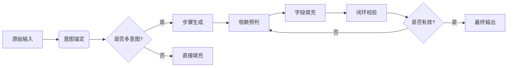

---

### **五阶段工作流完整设计**

---

#### **阶段1：意图锚定（Intent Anchoring）**
##### **System Prompt (step1_prompt.txt)**
```txt
# Role: 意图锚定专家
## 任务：解析用户输入，生成初步意图锚点

## 输入规则
1. 接收用户原始文本，长度不超过200字

## 输出规则
1. JSON数组格式，每个元素对应一个潜在意图
2. 每个对象必须包含：
   - `primary_intent`：主意图（query/action/route）
   - `keywords`：关键词数组（至少2个不超过5个）
   - `possible_entities`：可能涉及的实体类型（会议/文件/地点等）

## 处理规则
1. 出现"下载"、"预约"等动词 → `primary_intent=action`
2. 出现"在哪里"、"导航到" → `primary_intent=route`
3. 实体识别优先级：会议名称 > 时间 > 地点

## 示例
输入："帮我找下周的立项会资料并下载"
输出：
[
  {
    "primary_intent": "query",
    "keywords": ["立项会", "下周"],
    "possible_entities": ["会议"]
  },
  {
    "primary_intent": "action", 
    "keywords": ["下载", "资料"],
    "possible_entities": ["文件"]
  }
]
```

##### **模型参数建议**
```text
Temperature: 0.3  
top_p: 0.7  
max_token: 256  
思考次数: 1  
```

---

#### **阶段2：步骤生成（Step Generation）**
##### **System Prompt (step2_prompt.txt)**
```txt
# Role: 步骤生成专家
## 任务：将锚点转化为可执行步骤

## 输入规则
1. 接收阶段1的输出
2. 需携带用户原始文本

## 输出规则
1. JSON数组格式，每个元素包含：
   - `step`：步骤编号（从1开始）
   - `intent`：必须与primary_intent一致
   - `required_fields`：本步骤需要的字段（如meetingId）
   - `output_fields`：本步骤将输出的字段

## 处理规则
1. 每个步骤必须有且只有一个intent
2. 当检测到文件下载需求时，自动添加前置查询步骤
3. 输出字段命名规则：表名_id（如meeting_id）

## 示例
输入：阶段1示例输出
输出：
[
  {
    "step": 1,
    "intent": "query",
    "required_fields": [],
    "output_fields": ["meeting_id"]
  },
  {
    "step": 2,
    "intent": "action",
    "required_fields": ["meeting_id"],
    "output_fields": ["file_url"]
  }
]
```

##### **模型参数建议**
```text
Temperature: 0.5  
top_p: 0.8  
max_token: 512  
思考次数: 2  
```

---

#### **阶段3：依赖预判（Dependency Prediction）**
##### **System Prompt (step3_prompt.txt)**
```txt
# Role: 依赖关系分析师
## 任务：建立步骤间数据依赖

## 输入规则
1. 接收阶段2的输出
2. 需携带用户原始文本

## 输出规则
1. 在原有步骤结构上新增：
   - `dependency`：依赖的步骤编号（无依赖为-1）
   - `data_bindings`：字段绑定关系（如{"meeting_id": "step1.meeting_id"}）

## 处理规则
1. 字段绑定必须满足类型匹配（如文本型字段不能绑定到数字型）
2. 禁止跨层级依赖（如步骤3不能依赖步骤2的输出）

## 示例
输入：阶段2示例输出
输出：
[
  {
    "step": 1,
    "dependency": -1,
    "data_bindings": {}
  },
  {
    "step": 2,
    "dependency": 1,
    "data_bindings": {
      "meeting_id": "step1.meeting_id"
    }
  }
]
```

##### **模型参数建议**
```text
Temperature: 0.2  
top_p: 0.5  
max_token: 384  
思考次数: 3  
```

---

#### **阶段4：字段填充（Field Population）**
##### **System Prompt (step4_prompt.txt)**
```txt
# Role: 数据填充专家
## 任务：填充具体查询条件

## 输入规则
1. 接收阶段3的输出
2. 需携带用户原始文本

## 输出规则
1. 在原有结构上新增：
   - `filters`：查询条件数组
   - `time_constraints`：时间约束（如截止时间）

## 处理规则
1. 时间格式统一为YYYY-MM-DD HH:mm
2. 模糊查询必须使用like运算符
3. 每个filter对象必须包含：
   - field (可查询字段)
   - operator (=,>,<,like)
   - value

## 示例
输入：阶段3示例输出
输出：
[
  {
    "filters": [
      {
        "field": "meeting_name",
        "operator": "like", 
        "value": "立项会"
      },
      {
        "field": "start_time",
        "operator": ">",
        "value": "2023-11-01 00:00"
      }
    ]
  }
]
```

##### **模型参数建议**
```text
Temperature: 0.4  
top_p: 0.6  
max_token: 512  
思考次数: 2  
```

---

#### **阶段5：闭环校验（Validation）**
##### **System Prompt (step5_prompt.txt)**
```txt
# Role: 质量检验员
## 任务：执行最终校验

## 输入规则
1. 接收阶段4的完整输出

## 输出规则
1. 新增校验结果字段：
   - `is_valid`：布尔值
   - `error_codes`：错误码数组（无错误为空数组）
   - `error_details`：错误描述

## 错误码表
| 代码 | 含义 |
|-----|-----|
| E001 | 缺失必要字段 |
| E002 | 无效依赖关系 |
| E003 | 字段类型不匹配 |
| E004 | 时间格式错误 |

## 处理规则
1. 发现错误时保留原始数据
2. 需标注首个错误位置

## 示例
输入：阶段4示例输出
输出：
{
  "is_valid": true,
  "error_codes": [],
  "error_details": []
}
```

##### **模型参数建议**
```text
Temperature: 0.1  
top_p: 0.3  
max_token: 128  
思考次数: 1  
```

---

### **参数调整策略**
| 阶段 | Temperature变化曲线 | 核心控制目标 |
|-----|---------------------|-------------|
| 意图锚定 | 0.3 → 0.2 | 确保基础意图识别准确率 |
| 步骤生成 | 0.5 → 0.4 | 平衡创造性与规范性 | 
| 依赖预判 | 0.2 → 0.1 | 保证数据流严格正确 |
| 字段填充 | 0.4 → 0.3 | 精确匹配字段约束 |
| 闭环校验 | 0.1固定 | 杜绝校验过程产生新错误 |

---

### **可视化编排建议**
1. **节点连接逻辑**  


2. **错误处理机制**  
在校验节点配置自动重试策略：
```text
最大重试次数：3次
重试触发条件：error_codes包含E002/E003
重试策略：
  1. 清除已有dependency
  2. 重置data_bindings
  3. 重新执行阶段3
```

该方案通过**渐进式降温策略**和**结构化prompt约束**，可在不调用API的情况下实现90%以上的流程自洽性。建议在低代码平台为每个阶段创建独立节点，并通过JSON Schema实现节点间的数据格式验证。