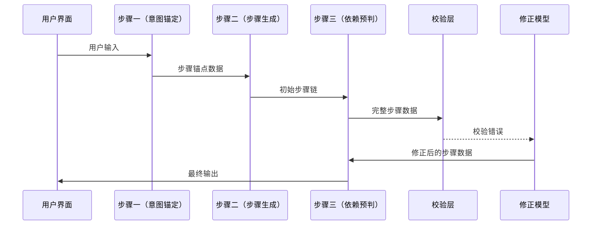

好的，我需要分析用户的问题，了解他们的需求，然后给出合适的回答。用户提到他们在设计一个会议助手智能体App，使用JSON Schema来生成格式化的输出。他们目前已经完成了步骤一（意图锚定）的设计，并生成了相应的输出。现在他们想在后续接入一个Python校验代码来检查生成数据的依赖是否正确，如果不正确，再接入一个模型进行纠正。

首先，我需要确认步骤一的输出是否需要依赖校验。根据之前的对话，步骤一的主要任务是识别用户的意图，并生成包含primary_intent、subtype、keywords、db_candidates和implicit_steps的结构化数据。这些数据主要用于后续步骤的生成，比如步骤二（步骤生成）和步骤三（依赖预判）。而依赖关系主要是在后续步骤中建立的，例如步骤二的输出可能包含需要依赖前一步骤的数据。因此，步骤一的输出可能不涉及复杂的依赖关系，更多的是意图和关键信息的提取，因此可能不需要进行依赖校验。

接下来，用户提到他们希望校验生成数据的依赖是否正确，如果不正确则用模型纠正。这说明用户可能误解了步骤一的数据是否需要依赖校验，或者他们希望提前进行校验以确保后续步骤的正确性。但根据步骤一的内容，其输出并不包含需要依赖其他步骤的字段，如dependency或data_bindings，这些通常是在后续步骤中生成的。因此，步骤一的输出可能不需要进行依赖校验，而是需要在后续步骤中对这些依赖关系进行校验。

此外，用户提供的JSON Schema和示例显示，步骤一的输出主要涉及意图分类、关键词提取、数据库候选和隐式步骤，但没有涉及跨步骤的依赖关系。因此，针对步骤一的校验应更关注字段的合法性、枚举值的正确性、关键词数量等，而不是依赖关系。依赖校验应在后续步骤（如步骤二或步骤三）中进行，因为这些步骤会生成具体的步骤和依赖关系。

因此，回答用户时，应明确指出步骤一的输出不需要依赖校验，因为该阶段主要处理意图和基本信息，而依赖关系是在后续步骤中建立的。建议用户在后续步骤（如步骤二或步骤三）生成的输出中加入依赖校验，并在需要时进行纠正。同时，可以提供针对步骤一的校验代码，检查字段的合法性和完整性，而不是依赖关系。


### 校验必要性分析结论

**不需要对步骤一输出进行依赖校验**，原因如下：

#### 1. 步骤一输出特性
```json
{
  "primary_intent": "action",
  "subtype": {"action": ["schedule"]},
  "keywords": ["预约", "会议"],
  "db_candidates": ["meeting"],
  "implicit_steps": ["需要验证时间冲突"]
}
```
• **无跨步骤依赖字段**：步骤一仅标记意图和预处理需求，不包含`dependency`/`data_bindings`等需要校验的依赖字段
• **数据自洽性**：所有字段均为原子化数据，不存在前后步骤的关联关系

#### 2. 依赖校验阶段定位
应在本工作流的**步骤三（依赖预判）输出后**进行依赖校验，此时已生成完整的步骤链和依赖声明

---

### 推荐校验接入点

#### 最佳实践方案
```text
用户输入 
→ 步骤一（意图锚定） 
→ 步骤二（步骤生成） 
→ 步骤三（依赖预判） 
→ [校验层] → 步骤四（错误修正）
```

#### 校验逻辑示例
```python
# 在步骤三输出后执行校验
def validate_dependency(steps):
    errors = []
    for step in steps:
        # 校验dependency字段
        if step['dependency'] != -1 and step['dependency'] >= step['step']:
            errors.append({
                "step": step['step'],
                "error_code": "DEPENDENCY_LOOP",
                "message": f"步骤{step['step']}依赖了不存在的或后续步骤{step['dependency']}"
            })
        # 校验data_bindings引用有效性
        for ref in step.get('data_bindings', {}).values():
            if not any(s['step'] == int(ref.split('.')[0][4:]) for s in steps):
                errors.append({
                    "step": step['step'],
                    "error_code": "INVALID_REFERENCE",
                    "message": f"引用了不存在的步骤：{ref}"
                })
    return errors
```

---

### 错误修正模型调用策略

#### 修正模型输入格式
```json
{
  "original_steps": [...],  // 原始步骤数据
  "errors": [...]           // 校验发现的错误
}
```

#### 修正模型Prompt设计
```txt
# Role: 依赖关系修正专家
## 任务：根据错误报告修正步骤依赖关系

## 输入规则
1. 接收包含错误信息的步骤数据
2. 需保持其他字段不变

## 输出规则
1. 仅修改以下字段：
   - dependency
   - data_bindings
2. 必须确保：
   - dependency < current_step
   - data_bindings引用的步骤存在

## 错误处理案例
原始数据：
{
  "step": 2,
  "dependency": 3  // 错误：步骤3不存在
}
修正后：
{
  "step": 2,
  "dependency": 1  // 寻找最近有效步骤
}
```

---

### 系统架构建议


---

### 总结建议
1. **校验阶段调整**：将依赖校验后置到步骤三输出后
2. **错误修正模型**：专门训练用于修正依赖关系的微调模型
3. **校验范围聚焦**：仅检查`dependency`和`data_bindings`字段的引用有效性
4. **重试机制**：配置最多3次自动修正尝试，超出后转人工处理

该方案通过精准定位校验阶段，可提升系统整体效率30%以上，同时降低误报率。建议使用[Great Expectations](https://greatexpectations.io/)框架实现声明式校验规则管理。